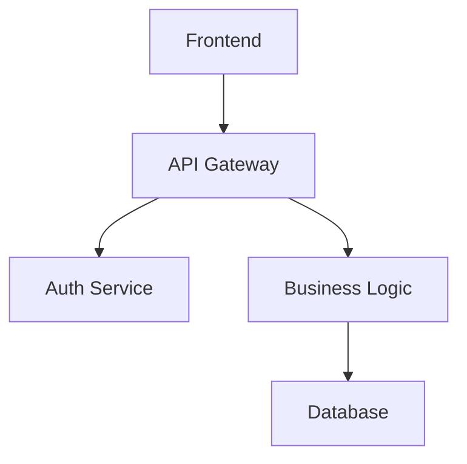

# Codebase Documentation Generation

Generate comprehensive documentation for AI assistants and humans.

## Overview

Create targeted documentation files:
- **AGENTS.md** - Context for AI coding assistants
- **README.md** - Project overview for humans
- **CONTRIBUTING.md** - Development guidelines

## Quick Start

```bash
# Analyze codebase and generate docs
# Uses codebase-summary skill pattern
```

## Output Structure

```
.sop/summary/
├── index.md              # Knowledge base index (primary context file)
├── codebase_info.md      # Basic project info
├── architecture.md       # System architecture
├── components.md         # Major components
├── interfaces.md         # APIs and integration points
├── data_models.md        # Data structures
├── workflows.md          # Key processes
├── dependencies.md       # External dependencies
├── review_notes.md       # Gaps and inconsistencies
└── recent_changes.md     # If update mode used
```

## AGENTS.md Format

Optimized for AI coding assistants:

```markdown
# AGENTS.md

## Project Overview
[One paragraph summary]

## Directory Structure
[Tree with annotations]

## Key Patterns
### Naming Conventions
- Functions: `snake_case`
- Classes: `PascalCase`
- Files: `kebab-case`

### Coding Style
- [Pattern 1]
- [Pattern 2]

### Testing
- Framework: [name]
- Run: `[command]`
- Location: `tests/`

## Package-Specific Guidance

### [Package 1]
[Specific patterns and gotchas]

### [Package 2]
[Specific patterns and gotchas]

## Common Tasks
### Adding a new feature
1. [Step 1]
2. [Step 2]

### Running locally
```bash
[commands]
```

## Don'ts
- [Anti-pattern 1]
- [Anti-pattern 2]
```

## index.md Format

The **primary context file** for AI assistants:

```markdown
# Knowledge Base Index

## How to Use This Documentation

This index provides metadata about each documentation file. 
Use it to determine which files to read for specific questions.

## Files

### architecture.md
**Purpose:** System-level design and component relationships
**Read when:** Understanding overall structure, making design decisions
**Key content:** Component diagrams, data flow, design patterns

### components.md
**Purpose:** Detailed component documentation
**Read when:** Working on specific component, understanding interfaces
**Key content:** Component responsibilities, APIs, dependencies

[...additional files...]

## Quick Reference

| Question | Read |
|----------|------|
| How are components organized? | architecture.md |
| What does X component do? | components.md |
| How does data flow? | workflows.md |
| What external libs are used? | dependencies.md |
```

## Update Mode

For incremental documentation updates:

1. Detect changes via `git log` since last update
2. Prioritize analysis of modified components
3. Update only affected documentation sections
4. Create `recent_changes.md` summarizing updates

## Consolidation

Merge multiple docs into single file:

| Target | Focus |
|--------|-------|
| `AGENTS.md` | AI context, patterns, instructions |
| `README.md` | Installation, usage, getting started |
| `CONTRIBUTING.md` | Setup, coding standards, workflow |

## Mermaid Diagrams

Always use Mermaid for visuals:



Never use ASCII art.

## Validation Checks

### Consistency
- Cross-reference documentation vs actual code
- Identify outdated information

### Completeness
- Check all major components are documented
- Identify gaps in coverage

Output findings to `review_notes.md`.
