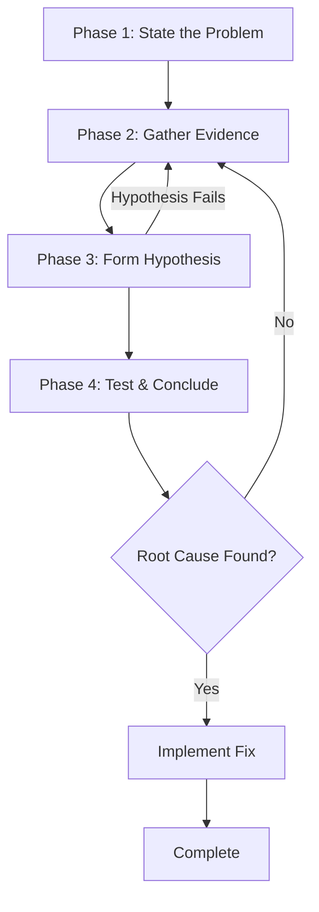
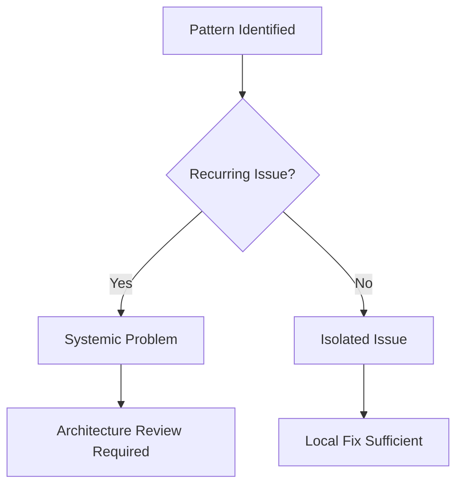

<mission_control>
<objective>Perform systematic root cause investigation through 4-phase process: gather, hypothesize, test, conclude.</objective>
<success_criteria>Root cause identified with evidence, hypothesis tested, solution with justification provided</success_criteria>
</mission_control>

## The Path to High-Quality Diagnoses

1. **Evidence beats assumptions** — Systematic investigation gathers concrete proof before forming conclusions. Evidence-based diagnosis prevents chasing phantom causes and ensures fixes address actual problems rather than perceived symptoms.

2. **Root causes prevent recurrence** — The 5 Whys technique reveals fundamental issues behind symptoms. Treating root causes eliminates problems permanently; treating symptoms guarantees they will return.

3. **Single hypotheses test cleanly** — One theory at a time enables clear verification. Testing multiple hypotheses simultaneously makes it impossible to know which fix worked, creating uncertainty and potential regressions.

4. **Patterns reveal scope** — Counting affected components distinguishes isolated bugs from architectural problems. Three or more similar failures indicate systemic issues requiring broader solutions than localized patches.

5. **Verification confirms understanding** — Testing hypotheses before implementing fixes validates comprehension of the problem. Verified fixes work correctly; untested fixes create technical debt and future issues.

6. **Pressure resistance ensures quality** — Systematic investigation resists shortcuts during time constraints. Rushed fixes without root cause analysis create more problems than they solve, increasing total debugging time.

## Workflow

**Phase 1: State the Problem** → Document symptom, error messages, reproduction steps, frequency

**Phase 2: Gather Evidence** → Collect logs, recent changes, environment data, diagnostic output

**Phase 3: Form Hypothesis** → Generate single testable theory using 5 Whys technique

**Phase 4: Test & Conclude** → Minimal reproduction test, verify hypothesis, implement fix

**Why:** Systematic root cause investigation prevents premature fixes that create technical debt.

## Navigation

| If you need...          | Read...                                  |
| :---------------------- | :--------------------------------------- |
| State the problem       | ## Workflow → Phase 1: State the Problem |
| Gather evidence         | ## Workflow → Phase 2: Gather Evidence   |
| Form hypothesis         | ## Workflow → Phase 3: Form Hypothesis   |
| Test & conclude         | ## Workflow → Phase 4: Test & Conclude   |
| Debugging process       | ## 4-Phase Debugging Process             |
| Basic bug investigation | ## Implementation Patterns → Pattern 1   |
| Deviation handling      | See deviation-rules skill                |

## 4-Phase Debugging Process



**If debugging stalls:** Apply deviation-rules to route to specialist.

## Operational Patterns

This skill follows these behavioral patterns:

- **Discovery**: Locate files matching patterns and search file contents for diagnostic evidence
- **Delegation**: Delegate exploration to specialized workers for investigation
- **Tracking**: Maintain a visible task list through the 4-phase process
- **Navigation**: Navigate code structure to trace root causes

## Implementation Patterns

### Pattern 1: Basic Bug Investigation

```typescript
// Step 1: Gather evidence
const diagnostic = {
  symptom: "API returns 500 error",
  errorMessages: errorLog,
  reproductionSteps: ["Request /api/users", "Include >100 items"],
  frequency: "Always",
};

// Step 2: Trace backward from error
function traceRootCause(error: Error): RootCause {
  const stackTrace = error.stack;
  const failurePoint = identifyFailurePoint(stackTrace);
  return findUpstreamCause(failurePoint);
}

// Step 3: Test hypothesis
const hypothesis = "Request size exceeds limit";
const test = { input: "151 items", expected: "500 error" };
```

### Pattern 2: Temporal Analysis

```bash
# When did this first occur?
git log --oneline --since="2 weeks ago" --until="1 week ago"

# What changed between working and broken?
git log -p --reverse --all -S "MAX_ITEMS"
```

### Pattern 3: 5 Whys Technique

```
Problem: API returns 500 for large requests

Why 1: Server throws internal error
→ Why 2: Array.reduce() fails on large arrays
→ Why 3: No maximum input validation
→ Why 4: Developer assumed frontend would limit
→ Why 5: No code review caught this gap

Root Cause: Missing input validation layer
Action: Add maxItems check at API boundary
```

## Troubleshooting

### Issue: Tests Fail But Code Seems Correct

| Symptom                                     | Solution                                                 |
| ------------------------------------------- | -------------------------------------------------------- |
| All tests passing locally, some fail in CI  | Check environment differences, timeouts, race conditions |
| Flaky tests that sometimes pass             | Look for async timing issues, mock dependencies properly |
| Test passes in isolation, fails with others | Check shared state leakage between tests                 |

**Fix**: Run tests with verbose output to identify timing/environment issues.

### Issue: Bug Recurs After Fix

| Symptom                            | Solution                                                           |
| ---------------------------------- | ------------------------------------------------------------------ |
| Same bug reappears weeks later     | Root cause wasn't truly fixed, or similar pattern exists elsewhere |
| Fix works temporarily, then breaks | Addressed symptom not cause, or fix created new issue              |

**Fix**: Re-run 5 Whys analysis to find deeper root cause.

### Issue: Multiple Hypotheses Conflicting

| Symptom                             | Solution                                    |
| ----------------------------------- | ------------------------------------------- |
| Several theories about what's wrong | Each hypothesis needs separate minimal test |
| Evidence points to multiple causes  | Pick ONE, test it, then move to next        |

**Fix**: Create minimal reproduction for each hypothesis independently.

### Issue: Pattern Recognition Fails

| Symptom                                           | Solution                                     |
| ------------------------------------------------- | -------------------------------------------- |
| Cannot determine if issue is isolated or systemic | Count affected components: 3+ = systemic     |
| Architecture seems fine but bugs persist          | Look at integration points, state management |

**Fix**: After 3+ failed hypotheses, question the pattern, not individual bugs.

## Investigation Format

<investigation_format>
<investigation>
<symptom>
<description>[What is the observable problem?]</description>
<error_messages>[Complete error text, stack traces]</error_messages>
<reproduction_steps>[Exact steps to reproduce]</reproduction_steps>
<frequency>[Always/Sometimes/Once]</frequency>
</symptom>

<evidence>
<logs>[Relevant log output]</logs>
<recent_changes>[Git diff, recent commits, config changes]</recent_changes>
<environment_data>[OS, versions, dependencies]</environment_data>
<diagnostic_output>[Output from diagnostic commands]</diagnostic_output>
</evidence>

<hypothesis>
<root_cause>[What is the likely root cause?]</root_cause>
<reasoning>[Why does this cause the symptom?]</reasoning>
<confidence>[High/Medium/Low - based on evidence]</confidence>
</hypothesis>

<test>
<minimal_reproduction>[Smallest test to confirm hypothesis]</minimal_reproduction>
<expected_result>[What should happen if hypothesis is correct]</expected_result>
<actual_result>[What actually happened]</actual_result>
<conclusion>[Confirmed/Rejected - hypothesis status]</conclusion>
</test>
</investigation>
</investigation_format>

## The Four-Phase Investigation

### Phase 1: Root Cause Investigation

Complete this phase before proposing any fixes.

#### Evidence Gathering Protocol

```bash
# Multi-component diagnostic instrumentation
diagnostic_check() {
  echo "=== System State ==="
  uname -a
  node --version 2>&1 || echo "Node not found"
  npm --version 2>&1 || echo "npm not found"

  echo -e "\n=== Error Context ==="
  tail -50 error.log 2>/dev/null || echo "No error.log"

  echo -e "\n=== Recent Changes ==="
  git log --oneline -10

  echo -e "\n=== Test Output ==="
  npm test 2>&1 | tail -100

  echo -e "\n=== Build Status ==="
  npm run build 2>&1 || echo "Build failed"
}
```

#### Root Cause Discovery Techniques

**1. Temporal Analysis**

- When did this first occur?
- What changed between working and broken?
- Commit history analysis
- Time-based correlation

**2. Backward Tracing**

- Start from error symptom
- Trace call stack backward
- Identify failure point
- Find root cause upstream

**3. Architecture Awareness**

- 3+ failures = architectural problem, not code issue
- Systemic patterns vs isolated bugs
- Integration points as failure sources
- State management issues

**4. 5 Whys Technique**

For complex problems, use iterative "why" questioning to drill down:

```
**Problem**: [Observable symptom]

**Why 1**: [First-level cause]
→ Because [explanation]

**Why 2**: [Second-level cause]
→ Because [explanation]

**Why 3**: [Third-level cause]
→ Because [explanation]

**Why 4**: [Fourth-level cause]
→ Because [explanation]

**Why 5**: [Root cause]
→ Because [explanation]

**Root Cause**: [The fundamental issue]
**Action**: [What to fix to prevent recurrence]
```

**Guidelines**:

- Be specific - each answer should be factual and verifiable
- Avoid blame - focus on systems and processes
- Check logic - ensure each answer explains the previous level
- Stop at root cause - when you reach something actionable

#### Evidence Documentation

Document ALL findings:

```markdown
## Root Cause Analysis

**Symptom:** [Exact error message or behavior]

**Evidence:**

1. [Source file:line] - What happened
2. [Source file:line] - Why it failed
3. [Source file:line] - Root cause

**Pattern:** [Isolated issue or systemic problem?]
```

### Phase 2: Pattern Analysis

**Question:** Is this isolated or systemic?

#### Pattern Recognition

**Isolated Patterns:**

- Single component affected
- Reproducible with specific input
- No cascade effects
- Local fix sufficient

**Systemic Patterns:**

- Multiple components affected
- Architecture-level issue
- State management problem
- Integration failure

#### Decision Tree



### Phase 3: Hypothesis Formation

Single hypothesis, minimal testing.

#### Hypothesis Criteria

**Good Hypotheses:**

- Based on evidence from Phase 1
- Falsifiable (can be proven wrong)
- Specific (predicts exact behavior)
- Actionable (suggests concrete fix)

**Bad Hypotheses:**

- Multiple competing hypotheses
- Based on assumptions, not evidence
- Too vague to test
- Confirmed without testing

#### Hypothesis Template

```markdown
## Hypothesis

**Based on:** [Evidence from Phase 1]

**Predicts:** [Specific behavior if hypothesis is true]

**Test:** [Minimal test to verify/falsify]

**Expected Result:** [What we should see]
```

### Phase 4: Implementation

Only after Phases 1-3 complete.

#### Implementation Protocol

1. **Implement fix** based on verified hypothesis
2. **Test fix** with minimal test case
3. **Verify no regressions** with broader test suite
4. **Document root cause** for future reference

#### Fix Validation

```bash
# Minimal test to verify fix
test_fix() {
  echo "Running minimal fix verification..."
  node -e "[test code]"
  if [ $? -eq 0 ]; then
    echo "✅ Fix verified"
  else
    echo "❌ Fix failed - re-examine hypothesis"
  fi
}
```

## Pressure Resistance

### Common Pressure Scenarios

**Time Pressure:**

- "Need to deploy soon"
- "User waiting for fix"
- "Demo in 30 minutes"

**Response:** Root cause investigation prevents future issues. Fixes without root cause create technical debt.

**Sunk Cost:**

- "Already spent 2 hours debugging"
- "Almost there with current approach"
- "Can't abandon this fix attempt"

**Response:** Sunk cost fallacy. Return to root cause with fresh perspective.

**Obvious Fix Temptation:**

- "It's obviously just a missing semicolon"
- "Clearly the API is down"
- "Just need to restart"

**Response:** Verify with evidence. Obvious ≠ Correct.

### Pressure Response Protocol

1. **Acknowledge pressure**
2. **Return to systematic approach**
3. **Brief justification**: "Root cause prevents recurrence"
4. **Continue investigation**

## Evidence Gathering Templates

### Bug Report Template

```markdown
## Bug Analysis Report

### Symptom

[Exact error message or behavior]

### Reproducibility

- [ ] Always
- [ ] Sometimes
- [ ] Specific conditions: [list]

### Environment

- OS: [uname -a]
- Node: [node --version]
- Dependencies: [npm list]

### Timeline

- First observed: [date/time]
- Last working: [date/time]
- Changes since: [git log]

### Evidence

1. [Source:line] - [description]
2. [Source:line] - [description]

### Root Cause

[Single sentence: What actually failed?]

### Pattern

- [ ] Isolated issue
- [ ] Systemic problem

### Hypothesis

[Based on evidence, what causes this?]

### Test

[How to verify hypothesis?]

### Fix

[What changes resolve the issue?]
```

### Test Failure Analysis

```markdown
## Test Failure Analysis

### Failure Message
```

[Exact test output]

```

### Stack Trace
```

[Full stack trace]

````

### Test Code
```javascript
[Relevant test code]
````

### Implementation

```javascript
[Relevant implementation]
```

### Root Cause

[What actually failed?]

### Fix Strategy

[How to resolve?]

```

## Systematic vs Heuristic Debugging

### When to Use Systematic

- **Complex failures** - Multiple components
- **Recurring issues** - Happened before
- **Production bugs** - High stakes
- **Architectural problems** - 3+ failures
- **Time pressure** - Prevent future issues

### When Heuristic is OK

- **Learning new code** - Exploratory
- **Prototyping** - Experimentation
- **Trivial issues** - Obvious typos
- **Time extreme** - Emergency hotfix

**Rule:** If systematic takes >30 minutes on obvious issue, switch to heuristic. But document root cause afterward.

## Key Principles

1. **Evidence-based investigation** - Gather proof, don't assume
2. **Single hypothesis focus** - Test one thing at a time
3. **Pattern recognition** - Distinguish isolated vs systemic
4. **Architecture awareness** - 3+ failures = systemic
5. **Pressure resistance** - Systematic beats intuition under stress

**Remember:** Fixing without root cause investigation is like putting tape on a water pipe without finding the crack.

## Common Rationalizations

| Excuse | Reality |
|--------|---------|
| "Issue is simple, don't need process" | Simple issues have root causes too. Process is fast for simple bugs. |
| "Emergency, no time for process" | Systematic debugging is FASTER than guess-and-check thrashing. |
| "Just try this first, then investigate" | First fix sets the pattern. Do it right from the start. |
| "I'll write test after confirming fix works" | Untested fixes don't stick. Test first proves it. |
| "The fix is obvious, let me just apply it" | Obvious ≠ Correct. Verify with evidence. |
| "We've already spent X hours, don't want to start over" | Sunk cost fallacy. Wrong approach wastes more time. |

## References

For related diagnostic capabilities:
- **Use the skill `quality-standards`** - Unified quality validation and three-way audit

---

## Common Mistakes to Avoid

### Mistake 1: Skipping Root Cause Investigation

❌ **Wrong:**
"It's obviously just a missing semicolon" → Apply fix immediately

✅ **Correct:**
Document symptom, trace to root cause, verify with evidence before fixing.

### Mistake 2: Testing Multiple Hypotheses at Once

❌ **Wrong:**
"Multiple theories could explain this, test them all simultaneously"

✅ **Correct:**
Form single hypothesis based on evidence. Test with minimal reproduction. Confirm or reject before next hypothesis.

### Mistake 3: Fixing Without Verification

❌ **Wrong:**
"Fix applied, seems to work" → Skip verification test

✅ **Correct:**
Test hypothesis with minimal reproduction before full fix. Verify no regressions.

### Mistake 4: Ignoring Systemic Patterns

❌ **Wrong:**
"Treat each bug individually" → Miss architectural issues

✅ **Correct:**
3+ similar failures indicate systemic problem. Address architecture, not symptoms.

### Mistake 5: Sunk Cost Rationalization

❌ **Wrong:**
"Already spent 2 hours, can't abandon this approach"

✅ **Correct:**
Return to root cause with fresh perspective. Wrong approach wastes more time.

---

## Validation Checklist

Before claiming diagnosis complete:

**Phase 1 - Problem Statement:**
- [ ] Symptom documented with exact error messages
- [ ] Reproduction steps verified
- [ ] Frequency and conditions identified

**Phase 2 - Evidence Gathering:**
- [ ] Logs and error output collected
- [ ] Recent changes reviewed (git history)
- [ ] Environment data documented

**Phase 3 - Hypothesis Formation:**
- [ ] Single hypothesis based on evidence
- [ ] Hypothesis is falsifiable
- [ ] Confidence level assigned (High/Medium/Low)

**Phase 4 - Test & Conclude:**
- [ ] Minimal reproduction test created
- [ ] Hypothesis confirmed or rejected
- [ ] Root cause identified with file:line evidence
- [ ] Fix strategy documented

**Pattern Recognition:**
- [ ] Isolated vs systemic determined
- [ ] 3+ failures = architectural flag raised

---

## Best Practices Summary

✅ **DO:**
- Gather concrete evidence before forming conclusions
- Test one hypothesis at a time
- Use 5 Whys technique to reach root cause
- Document root cause for future reference
- Resist pressure to skip systematic approach

❌ **DON'T:**
- Apply fixes without root cause investigation
- Test multiple hypotheses simultaneously
- Assume obvious = correct
- Ignore patterns (3+ failures = systemic)
- Fall for sunk cost rationalization

---

## Genetic Code

This component carries essential Seed System principles for context: fork isolation:

**Delta Standard**: Good Component = Expert Knowledge − What Claude Already Knows

**Recognition Questions**:
- "Would Claude know this without being told?" → Delete (zero delta)
- "Can this work standalone?" → Fix if no (non-self-sufficient)
- "Did I read the actual file, or just see it in grep?" → Verify before claiming

<critical_constraint>
**Portability Invariant: Zero External Dependencies**

This component must work in a project with ZERO .claude/rules/ access.
All necessary philosophy is embedded within this skill.

**Evidence Requirements**

Complete Phase 1 (Root Cause Investigation) before proposing fixes.
Document symptoms, evidence, hypothesis before implementing.
Test hypothesis with minimal reproduction before full fix.

**Single Hypothesis Protocol**

Form single hypothesis based on evidence.
Test with minimal reproduction.
Confirm or reject before next hypothesis.

**Architecture Pattern Recognition**

Three or more similar failures indicate architectural problems requiring broader solutions than localized patches.
</critical_constraint>
```
