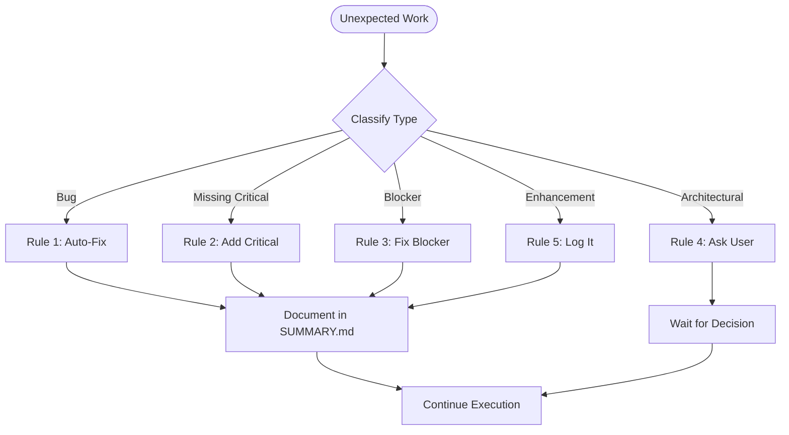

<mission_control>
<objective>Handle unexpected work during execution by classifying deviations and applying mechanistic rules for autonomous resolution.</objective>
<success_criteria>All deviations classified via trigger conditions, mechanistic rule application, 80-95% autonomy</success_criteria>
</mission_control>

## The Path to High-Autonomy Success

Mechanistic deviation handling enables 80-95% autonomy because predictable responses to unexpected events build trust between pilot and agent.

**1. Classification-first clarity preserves momentum**

When unexpected work appears, classify it immediately by type and impact. Clear categorization (Bug/Missing Critical/Blocker/Architecture/Enhancement) reveals the appropriate response without requiring consultation. This preserves execution flow because the agent knows exactly what to do in each case.

**2. Trigger-based mechanistic rules enable autonomy**

Using test conditions (logic errors, unambiguous fixes, structural changes) transforms subjective judgment into objective classification. The agent applies rules based on deviation properties, not interpretation. This works because trigger conditions map directly to actions: auto-fix bugs, add missing essentials, fix blockers, ask for architectural changes, log enhancements.

**3. Documentation creates transparency and trust**

Every deviation gets logged to SUMMARY.md with explanation of what was done and why. The user sees the complete picture of planned vs actual work, building confidence in autonomous execution. Documentation prevents "silent deviations" where work happens without visibility.

**4. Conservative architectural boundaries prevent overreach**

Only trigger user consultation for structural changes (file/folder reorganization, component additions, schema modifications). This design works because architectural decisions have lasting impact and multiple valid approaches. Being conservative here prevents the agent from making far-reaching changes without explicit approval.

**5. Generous handling of missing essentials ensures completeness**

When functionality is clearly essential and was simply overlooked, add it without asking. Error handling, input validation, and debugging support are completeness enablers, not scope creep. This principle works because the implementation becomes functional rather than requiring a second pass for basics.

**6. Enhancement logging prevents scope drift**

Valuable but non-critical improvements get logged for later consideration. This acknowledges good ideas without derailing current work. The pattern works because it respects the plan while capturing insights for future iterations.

**Why this leads to success**: 80-95% autonomy emerges from clear rules for common situations. The agent handles routine deviations independently, consults only for true architectural decisions, and documents everything for transparency. The user gets high completion rates with full visibility into what changed and why.

## Workflow

**Rule 1: Bug** → Logic/syntax error with unambiguous fix → Auto-fix

**Rule 2: Missing Critical** → Essential functionality missing → Add it

**Rule 3: Blocker** → Blocking issue → Fix immediately

**Rule 4: Architecture** → File/folder structure change → STOP, ask user

**Rule 5: Enhancement** → Nice-to-have → Log for later

**Why:** Mechanistic rules enable 80-95% autonomy—deviations are classified and resolved without asking.

## Operational Patterns

This skill follows these behavioral patterns:

- **Tracking**: Maintain a visible task list for deviation classification
- **Consultation**: Consult the user with options when deviation type is unclear
- **Delegation**: Route to specialized workers based on deviation classification

## Navigation

| If you need...           | Read...                                |
| :----------------------- | :------------------------------------- |
| Bug fix                  | ## Workflow → Rule 1: Bug              |
| Missing critical feature | ## Workflow → Rule 2: Missing Critical |
| Blocker resolution       | ## Workflow → Rule 3: Blocker          |
| Architecture change      | ## Workflow → Rule 4: Architecture     |
| Enhancement logging      | ## Workflow → Rule 5: Enhancement      |
| Deviation classification | ## Workflow Decision Tree              |

### What Type of Deviation?

| If you discover...              | Rule                      | Action          |
| ------------------------------- | ------------------------- | --------------- |
| Logic/syntax error              | Rule 1 (Bug)              | Auto-fix        |
| Missing essential functionality | Rule 2 (Missing Critical) | Add             |
| Blocking issue                  | Rule 3 (Blocker)          | Fix             |
| File/folder structure change    | Rule 4 (Architecture)     | STOP - Ask user |
| Nice-to-have improvement        | Rule 5 (Enhancement)      | Log for later   |

## Implementation Patterns

### Pattern 1: Bug Classification

```typescript
// When you encounter an error during implementation
function classifyDeviation(issue: unknown): DeviationType {
  const test = {
    isLogicError: isLogicError(issue),
    isSyntaxError: isSyntaxError(issue),
    fixIsUnambiguous: hasClearSolution(issue),
    changesArchitecture: affectsStructure(issue),
  };

  if (test.isLogicError && test.fixIsUnambiguous && !test.changesArchitecture) {
    return "bug"; // Rule 1: Auto-fix
  }
  return "unknown"; // Requires human judgment
}
```

### Pattern 2: Missing Critical Classification

```typescript
function isMissingCritical(issue: Issue): boolean {
  return {
    essentialForFunctionality: !issueFeatureExists(),
    wouldMakeImplementationFail: !issue.wouldCauseFailure(),
    solutionIsStraightforward: hasClearImplementation(),
  };
}
```

### Pattern 3: Architecture Change Detection

```typescript
function isArchitectureChange(issue: Issue): boolean {
  return {
    changesFileFolderStructure: modifiesStructure(),
    addsRemovesComponents: changesComponentCount(),
    changesDataModels: modifiesSchema(),
  };
  // If any true → Rule 4: STOP and ask
}
```

### Pattern 4: Documenting Deviations

```markdown
## Deviations Log

### Auto-Fixed Bugs

- MD5 password hashing → Fixed to bcrypt (security fix)

### Added Missing Critical

- No error handling for database → Added error middleware

### Fixed Blockers

- Missing dependency → Installed dependency

### Logged Enhancements

- Code refactoring opportunity (deferred)
```

## Troubleshooting

### Issue: Wrong Classification

| Symptom                          | Solution                                       |
| -------------------------------- | ---------------------------------------------- |
| Treating architectural as bug    | Check: Does this change file/folder structure? |
| Treating bug as architectural    | Check: Is there a clear, unambiguous fix?      |
| Treating enhancement as critical | Check: Is this essential for functionality?    |

### Issue: Not Documenting Deviations

| Symptom                          | Solution                                 |
| -------------------------------- | ---------------------------------------- |
| Deviations lost in context       | Always document to SUMMARY.md            |
| User doesn't know what was fixed | Explain WHY each deviation was necessary |

### Issue: Being Too Liberal with Rule 4

| Symptom                               | Solution                                          |
| ------------------------------------- | ------------------------------------------------- |
| Asking about every small change       | Only Rule 4 for structural changes                |
| "When in doubt, ask" becoming default | Rule 4 for structural + multiple valid approaches |

### Issue: Being Too Conservative with Rule 2

| Symptom                              | Solution                      |
| ------------------------------------ | ----------------------------- |
| Leaving out essential error handling | Be generous with Rule 2       |
| "Not in the plan" as excuse          | If clearly overlooked, add it |

## Workflows

### When Unexpected Work Appears

1. **Classify** → What type of deviation? (Bug/Missing/Blocker/Architecture/Enhancement)
2. **Apply Rules** → Execute based on trigger conditions
3. **Document** → Log to SUMMARY.md with explanation
4. **Continue** → Return to planned work (or wait for Rule 4)

### Example Execution Flow

```typescript
// Original Plan: Add JWT authentication
const deviation = discoverIssue("MD5 password hashing");

if (isBug(deviation)) {
  // Rule 1: Auto-fix
  fixToBcrypt();
  document("Fixed insecure MD5 hashing");
}

if (isMissingCritical(deviation)) {
  // Rule 2: Add
  addErrorHandling();
  document("Added error handling for database operations");
}

if (isArchitectureChange(deviation)) {
  // Rule 4: STOP
  askUser("Current data model doesn't support settings");
  return; // Wait for decision
}
```

## PATTERN: Deviation Logic

When encountering unexpected work, apply these trigger-based rules:

### Rule 1: Bug

**Test conditions**:
- Is this a logic error, syntax error, type error, security vulnerability, or performance issue?
- Is the fix unambiguous (clear solution exists)?
- Does the fix not change architecture?

**Action**: Auto-fix without asking

**Examples**:
- MD5 password hashing → Fix to bcrypt (security)
- Missing semicolon → Add semicolon (syntax)
- Unhandled exception → Add try/catch (logic)

### Rule 2: Missing Critical

**Test conditions**:
- Is this essential for functionality that was clearly overlooked?
- Would not adding it make the implementation non-functional?
- Is the solution straightforward and unambiguous?

**Action**: Add without asking

**Examples**:
- No error handling for database → Add error middleware
- Missing input validation → Add validation
- No logging for debugging → Add logs

### Rule 3: Blocker

**Test conditions**:
- Does this block progress on planned work?
- Is resolution necessary to continue?
- Does solution not require architectural decision?

**Action**: Fix without asking

**Examples**:
- Missing dependency → Install dependency
- Wrong environment variable → Set variable
- File permission issue → Fix permissions

### Rule 4: Architecture Change

**Test conditions**:
- Does this change file/folder structure?
- Does this add/remove major components?
- Does this change data models or schemas?
- Does this affect system architecture?

**Action**: STOP and ask user

**Examples**:
- Need to add new service layer
- Database schema change required
- File restructure needed

### Rule 5: Enhancement

**Test conditions**:
- Is this a nice-to-have improvement?
- Would this be better logged for later?
- Is this not essential for current task?

**Action**: Log for later, continue

**Examples**:
- Code refactoring opportunity
- Performance optimization
- Documentation improvement

## PATTERN: Decision Flow

When encountering unexpected work:

1. **Classify**: What type of deviation is this?
   - Bug? → Trigger: bug
   - Missing critical? → Trigger: missing_critical
   - Blocker? → Trigger: blocker
   - Architecture change? → Trigger: architecture_change
   - Enhancement? → Trigger: enhancement

2. **Apply trigger rules**:
   - If bug: Auto-fix
   - If missing_critical: Add
   - If blocker: Fix
   - If architecture_change: STOP and ask
   - If enhancement: Log and continue

3. **Report action**: Always explain what you did and why

---

- Modifying system boundaries
- Changing patterns or frameworks
- Altering deployment architecture

**When to apply**:

- Change affects system structure
- Change has multiple valid approaches
- Change would require updating other components
- Change conflicts with existing patterns

**Example**:

```
Plan: "Add user preferences"
Discovery: Current data model doesn't support user-specific settings
Action: STOP and ask user about data model approach
Reason: Architectural decision, multiple valid options
```

**Recognition**: "Does this change the system structure or have multiple valid approaches?"

### Rule 5: Log Enhancements

**Definition**: Log non-critical improvements for later consideration.

**What counts as enhancements**:

- Code refactoring for clarity
- Adding convenience features
- Performance optimizations (non-critical)
- Documentation improvements
- Test coverage expansions

**When to apply**:

- Improvement is valuable but not essential
- Enhancement doesn't block current work
- Can be deferred without impact

**Example**:

```
Plan: "Add payment processing"
Discovery: Error messages could be more user-friendly
Action: Log to SUMMARY.md as enhancement
Reason: Nice to have, not essential for completion
```

**Recognition**: "Is this valuable but not essential for current task?"

## SUMMARY.md Documentation

All deviations are documented in `SUMMARY.md`:

```markdown
# Execution Summary

## Original Plan

[Original plan description]

## Deviations Log

### Auto-Fixed Bugs

- [Bug description] → [Fix applied]
- [Bug description] → [Fix applied]

### Added Missing Critical

- [Missing functionality] → [What was added]

### Fixed Blockers

- [Blocker] → [Resolution]

### Logged Enhancements

- [Enhancement idea] (deferred)
- [Enhancement idea] (deferred)

## Architectural Decisions

[Only if Rule 4 was triggered]

- [Decision point] → [User's decision]
```

**Recognition**: "Is every deviation documented for transparency?"

## Application Workflow

### During Execution

When encountering unexpected work:



1. **Classify the deviation type**

2. **Apply the appropriate rule**
   - Execute the rule's action
   - Document in SUMMARY.md
   - Continue execution (or wait for user if Rule 4)

3. **Continue with plan**
   - Return to planned work
   - Update task status if needed

### Example Execution

```
Original Plan: Add JWT authentication to API

During Implementation:
1. Discovery: Password hashing uses MD5
   → Rule 1 (Bug): Fix to bcrypt
   → Document: Fixed insecure MD5 hashing

2. Discovery: No error handling for database failures
   → Rule 2 (Missing Critical): Add error handling
   → Document: Added error handling for database operations

3. Discovery: User model doesn't have email field
   → Rule 4 (Architectural): STOP and ask user
   → Wait for user decision on data model

4. Discovery: Token expiration check could be more efficient
   → Rule 5 (Enhancement): Log for later
   → Document: Deferred: Optimize token validation

Result: Authentication complete with documented deviations
```

## Recognition Questions

Before applying any rule, ask:

**Rule 1 (Bugs)**:

- "Is this a bug with a clear, unambiguous fix?"
- "Does the fix preserve the intended architecture?"

**Rule 2 (Missing Critical)**:

- "Is this essential for functionality?"
- "Was this clearly overlooked, not a new feature?"
- "Is the implementation straightforward?"

**Rule 3 (Blockers)**:

- "Does this block progress?"
- "Is there an unambiguous resolution?"

**Rule 4 (Architectural)**:

- "Does this change system structure?"
- "Are there multiple valid approaches?"
- "Would other components be affected?"

**Rule 5 (Enhancements)**:

- "Is this valuable but not essential?"
- "Can this be deferred without impact?"

---

## Common Mistakes to Avoid

### Mistake 1: Treating Architecture as Bug

❌ **Wrong:**
"Found a file structure issue, auto-fixing"

✅ **Correct:**
"File/folder structure change detected → STOP and ask user (Rule 4)"

### Mistake 2: Asking About Everything

❌ **Wrong:**
"Should I add error handling?" (Rule 2 is for missing essential functionality)

✅ **Correct:**
"If clearly essential and overlooked → Add without asking"

### Mistake 3: Not Documenting Deviations

❌ **Wrong:**
Fixed issues silently, user never knows what was different from plan

✅ **Correct:**
Document every deviation in SUMMARY.md with explanation and why

### Mistake 4: Being Too Conservative with Rule 2

❌ **Wrong:**
"Not in the plan" → Leave out error handling, input validation

✅ **Correct:**
If essential for functionality and clearly overlooked → Add it

### Mistake 5: Wrong Classification

❌ **Wrong:**
Treating enhancement as critical, or bug as architecture

✅ **Correct:**
Use trigger conditions: bug (logic error + unambiguous fix), enhancement (nice-to-have)

---

## Validation Checklist

Before claiming deviation handling complete:

**Classification:**
- [ ] Deviation classified correctly (Bug/Missing/Blocker/Architecture/Enhancement)
- [ ] Trigger conditions verified for chosen rule
- [ ] Rule 4 applied only for structural changes

**Resolution:**
- [ ] Bug fixed with unambiguous solution
- [ ] Missing critical added without asking
- [ ] Blocker resolved immediately
- [ ] Enhancement logged for later

**Documentation:**
- [ ] Every deviation documented in SUMMARY.md
- [ ] Explanation provided for each deviation
- [ ] Original plan vs actual work clear

**Autonomy:**
- [ ] 80-95% autonomy achieved (only Rule 4 requires asking)
- [ ] Rules applied mechanistically (not subjective judgment)

---

## Best Practices Summary

✅ **DO:**
- Classify deviations immediately when discovered
- Apply rules mechanistically based on trigger conditions
- Be generous with Rule 2 (missing critical) for essential functionality
- Be conservative with Rule 4 (architectural) - only for structural changes
- Document EVERY deviation with explanation and why
- Preserve execution flow by handling without asking when possible

❌ **DON'T:**
- Auto-fix architectural changes without asking
- Treat enhancements as critical scope creep
- Skip documentation of deviations
- Apply subjective judgment instead of trigger conditions
- Ask about every small change (only Rule 4 for structural)
- Ignore missing essential functionality

---

## Arguments

This skill is loaded automatically during plan execution. No direct invocation needed.

---

## Genetic Code

This component carries essential Seed System principles for context: fork isolation:

<critical_constraint>
**Portability Invariant**: This skill MUST work in a project containing ZERO `.claude/rules/` files. All necessary behavioral guidance is contained within this SKILL.md.

**Delta Standard**: Good Component = Expert Knowledge − What Claude Already Knows

**Recognition Questions**:

- "Would Claude know this without being told?" → Delete (zero delta)
- "Can this work standalone?" → Fix if no (non-self-sufficient)
- "Did I read the actual file, or just see it in grep?" → Verify before claiming

