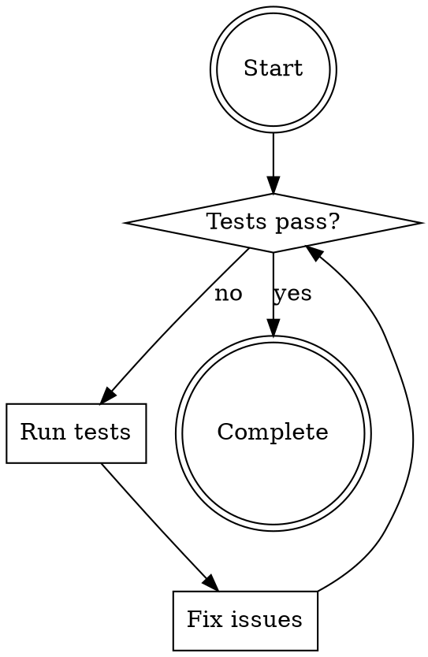
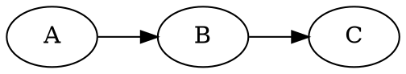
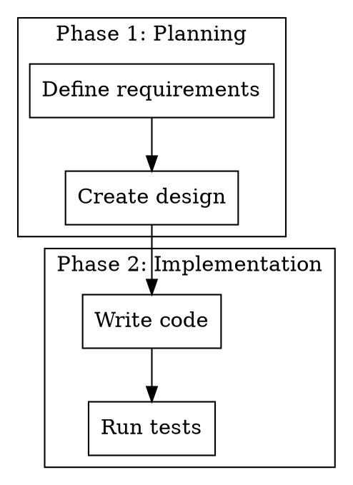
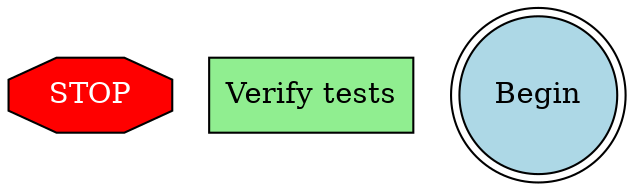
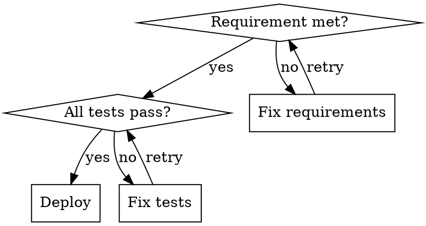
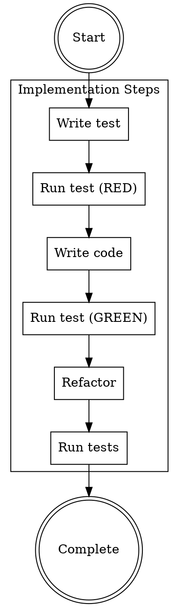
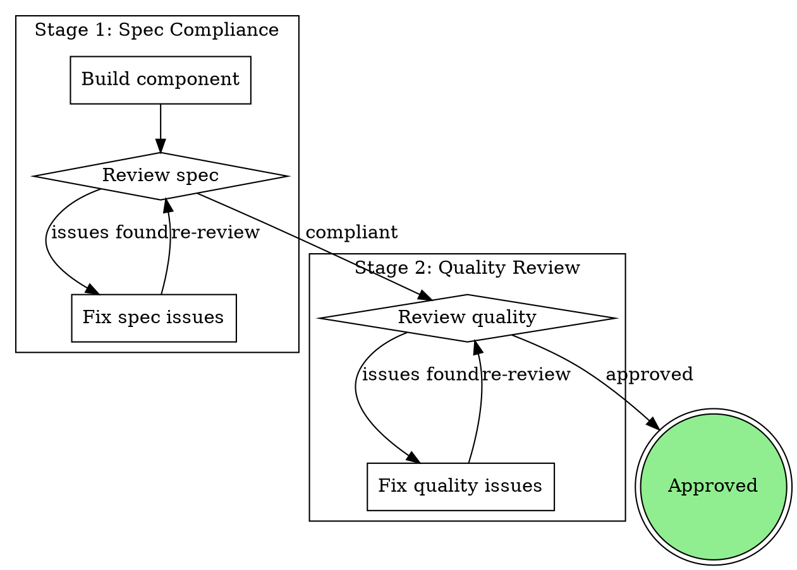
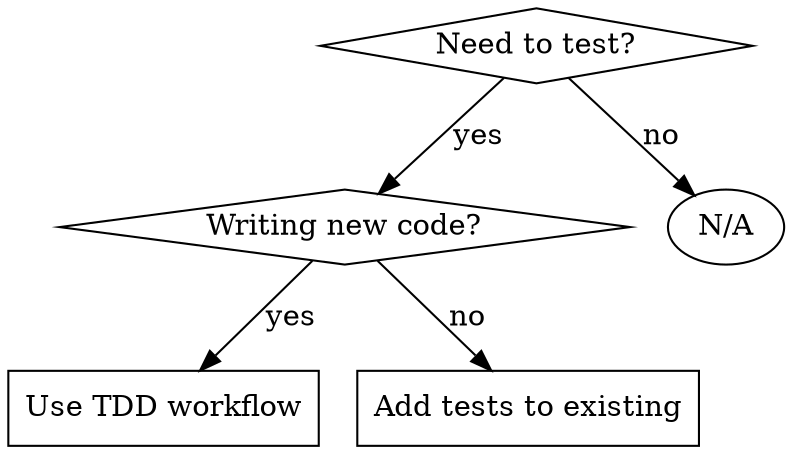

# GraphViz Documentation Conventions

Standardize process visualization using GraphViz DOT language for clear, consistent documentation.

## Overview

GraphViz provides a standardized way to visualize workflows, decision trees, and process flows. Following these conventions ensures consistent, readable diagrams across all meta-skills.

## Node Shapes Convention

Use standardized shapes to communicate meaning:

| Shape | Meaning | Example |
|-------|---------|---------|
| **Diamond** | Questions/Decisions | "Tests pass?" |
| **Box** | Actions/Processes | "Run test command" |
| **Double Circle** | Start/End States | "Begin", "Complete" |
| **Ellipse** | States/Conditions | "Failing test", "Clean code" |
| **Octagon** | Critical/Warning | "STOP", "ERROR" |

### Example Usage



## Edge Labels Convention

Always label edges to show conditions/paths:

```dot
"Decision point" -> "Path A" [label="condition 1"];
"Decision point" -> "Path B" [label="condition 2"];
"Decision point" -> "Path C" [label="otherwise"];
```

### Common Label Patterns

| Pattern | Usage | Example |
|---------|-------|---------|
| `[label="yes/no"]` | Binary decisions | "Is valid? yes/no" |
| `[label="if X"]` | Conditional paths | "if error" |
| `[label="otherwise"]` | Default path | "if no match" |
| `[label="loop"]` | Cycle back | "back to start" |

## Rank Direction

Control flow direction with `rankdir`:

- **LR** (Left-to-Right): For horizontal flows
- **TB** (Top-to-Bottom): For vertical flows (default)



## Clustering

Group related elements using subgraphs:



## Styling

Use minimal styling for emphasis:



### Color Guidelines

- **Red**: Critical/Stop/Warning
- **Light Green**: Success/Approved
- **Light Blue**: Start/End states
- **Yellow**: Caution (use sparingly)

## Common Patterns

### Decision Tree



### Process Flow



### Two-Stage Review



## Best Practices

### DO

✅ Use consistent node shapes
✅ Label all edges
✅ Keep diagrams simple
✅ Group related elements with clusters
✅ Use rankdir for readability
✅ Use minimal styling for emphasis

### DON'T

❌ Overuse colors
❌ Create complex diagrams (split into multiple)
❌ Forget edge labels
❌ Mix horizontal and vertical in same diagram
❌ Use decorative elements
❌ Create overly wide diagrams

## Integration with Meta-Skills

### When to Use

Include GraphViz diagrams for:
- **Decision trees** (when to use a skill)
- **Process flows** (step-by-step workflows)
- **Two-stage reviews** (spec + quality)
- **Review loops** (iterative processes)

### Documentation Standards

**Every workflow diagram should include:**
1. Clear title
2. Meaningful node labels
3. Labeled edges
4. Consistent shapes
5. Proper rank direction

### Example Integration

```markdown
## When to Use


```

## Tools

### Rendering

GraphViz diagrams render automatically in:
- GitHub/GitLab markdown
- Many markdown viewers
- VS Code (with GraphViz extension)

### Editing

- **Online**: Draw.io, Mermaid.live
- **Desktop**: GraphViz, yEd
- **Text**: Edit DOT source directly

## Reference Examples

### Superpowers Patterns

Superpowers uses GraphViz extensively:
- Skill invocation flow
- Debugging phases
- Subagent orchestration
- Two-stage review process

### Ralph Integration

Ralph validation uses GraphViz for:
- Two-stage review workflow
- Hat coordination patterns
- Validation gates
- Review loops

## Summary

**Key Conventions:**
- Diamond = decision
- Box = action
- Double circle = start/end
- Label edges
- Use rankdir for flow direction
- Cluster related elements
- Minimal styling

**Benefits:**
- Consistent documentation
- Clear communication
- Standardized patterns
- Professional appearance

Following these conventions ensures all meta-skills have consistent, readable process visualizations.
