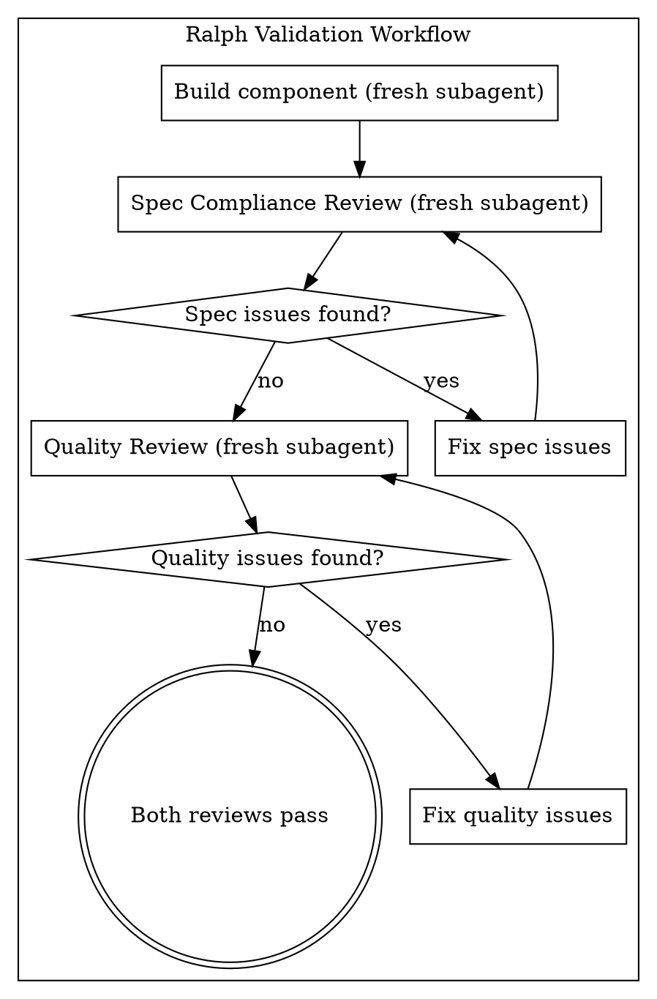

# Two-Stage Review Validation

Ralph's enhanced validation workflow using the Superpowers two-stage review process.

## Overview

Instead of single-review validation, Ralph now uses two distinct review stages:

1. **Spec Compliance Review** - Does the component match the blueprint?
2. **Quality Review** - Is the component well-built?

**Core principle:** Fresh subagent per stage + systematic review = high quality, fast iteration

## The Two-Stage Process



## Stage 1: Spec Compliance Review

### Purpose
Verify the component matches the blueprint exactly (nothing more, nothing less).

### Key Principle
**"Do not trust the report"** - Builder may be optimistic or incomplete. Always verify independently.

### What to Check

**Missing requirements:**
- [ ] All blueprint requirements implemented?
- [ ] All acceptance criteria met?
- [ ] No skipped features?

**Extra work:**
- [ ] No features beyond blueprint?
- [ ] No over-engineering?
- [ ] No "nice to haves" not requested?

**Portability:**
- [ ] Zero external .claude/rules dependencies?
- [ ] All context bundled in component?
- [ ] Works in fresh project?

**Misunderstandings:**
- [ ] Blueprint interpreted correctly?
- [ ] Right problem solved?
- [ ] Implementation approach aligned?

### Report Format

```
✅ Spec compliant
```

OR

```
❌ Issues found:
- Missing: [specific requirement] (file:line)
- Extra: [unrequested feature] (file:line)
- Portability: [external dependency] (file:line)
```

### Review Loop
- Issues found → Builder fixes → Re-review
- No issues → Stage 2

## Stage 2: Quality Review

### Purpose
Verify component is well-built according to Seed System standards.

### Prerequisites
**Spec compliance MUST pass** before quality review.

### What to Check

**Seed System Patterns:**
- [ ] Progressive disclosure tiers (Tier 1: metadata, Tier 2: main, Tier 3: references)
- [ ] Imperative voice for instructions
- [ ] Clear trigger phrases in descriptions
- [ ] Self-contained (zero external dependencies)
- [ ] Success Criteria for self-validation

**Code Quality:**
- [ ] Clean, maintainable code
- [ ] Clear naming (describes what, not how)
- [ ] No dead code or TODOs
- [ ] Proper error handling
- [ ] Consistent formatting

**Documentation:**
- [ ] Clear, concise descriptions
- [ ] Concrete examples users can copy
- [ ] Proper markdown formatting
- [ ] No filler or unnecessary text

**Testing:**
- [ ] Tests verify actual behavior
- [ ] Edge cases covered
- [ ] Portable tests (no external setup)

### Report Format

```
Strengths:
- [what was built well]

Issues:
- Critical: [must fix before production]
- Important: [should fix for quality]
- Minor: [nice to have]

Assessment: Approved / Needs fixes
```

### Review Loop
- Issues found → Builder fixes → Re-review
- No issues → Validation complete

## Fresh Subagent Per Stage

### Why Fresh Subagents?

**Context isolation:**
- No pollution from previous stage
- Fresh perspective on component
- Independent verification

**Cost efficiency:**
- Builder + Spec reviewer + Quality reviewer = 3 subagents
- But catches issues early (cheaper than debugging later)

**Quality gains:**
- Spec reviewer catches blueprint violations
- Quality reviewer catches building issues
- Two independent verifications

### Context Provision

Each subagent gets complete context upfront:

```yaml
Spec Reviewer:
  requirements: [full blueprint text]
  builder_report: [what builder claims]
  component_files: [actual code]
  directory: [path to component]

Quality Reviewer:
  spec_results: [compliance outcome]
  component_files: [actual code]
  seed_standards: [quality criteria]
  directory: [path to component]
```

## Integration with Ralph

### Ralph Validated Structure

```
ralph_validated/
├── artifacts/
│   └── .claude/
│       └── skills/
│           └── my-skill/
│               └── SKILL.md
├── evidence/
│   ├── blueprint.yaml
│   ├── test_spec.json
│   └── TWO_STAGE_REVIEW/
│       ├── spec_compliance.md
│       │   ├── review_1.md
│       │   └── review_2.md (if re-review)
│       └── quality_review.md
│           ├── review_1.md
│           └── review_2.md (if re-review)
├── validation/
│   ├── verification_commands.md
│   └── test_results.md
└── ENHANCED_REPORT.md
```

### Validation Workflow

1. **Builder subagent** creates component
2. **Spec reviewer subagent** verifies compliance
   - Issues found → back to builder
   - No issues → stage 2
3. **Quality reviewer subagent** verifies quality
   - Issues found → back to builder
   - No issues → validation complete
4. **Verification** run fresh tests/validation
5. **Report** with evidence from both stages

### Quality Gates

**Stage 1 (Spec Compliance):**
- [ ] All blueprint requirements met
- [ ] No extra features
- [ ] Portability confirmed

**Stage 2 (Quality):**
- [ ] Seed System patterns followed
- [ ] Code quality standards met
- [ ] Documentation complete
- [ ] Tests comprehensive

**Final Verification:**
- [ ] Fresh test run (verification-before-completion)
- [ ] All evidence collected
- [ ] Confidence score calculated

## Benefits

### vs Single Review

**Spec compliance first:**
- Catches blueprint violations early
- Prevents over/under-building
- Ensures requirements are met

**Quality review second:**
- Validates building quality
- Checks Seed System adherence
- Ensures maintainability

**Both stages:**
- Systematic verification
- Fresh perspective at each stage
- Higher confidence in results

### vs Manual Review

**Consistency:**
- Same criteria every time
- Systematic verification
- No missed checks

**Speed:**
- Parallel-safe (subagents don't interfere)
- Fresh context per stage
- Review loops until approved

**Quality:**
- Independent verification
- Evidence-based reporting
- Zero tolerance for issues

## Implementation

### Prompt Templates

Use templates from `.claude/skills/meta-critic/templates/`:

- `component-builder-prompt.md` - Builder subagent
- `spec-reviewer-prompt.md` - Spec compliance
- `quality-reviewer-prompt.md` - Quality review

### Example Workflow

```bash
# Stage 1: Spec Compliance
Task("Review Spec Compliance: my-skill", {
  prompt: render_template("spec-reviewer-prompt.md", {
    requirements: blueprint.requirements,
    builder_report: builder.report
  })
})

# Stage 2: Quality Review (only if Stage 1 passed)
Task("Review Quality: my-skill", {
  prompt: render_template("quality-reviewer-prompt.md", {
    spec_results: spec_compliance.results,
    component_files: component.files
  })
})
```

## Red Flags

**Never:**
- Skip stages (spec OR quality)
- Proceed with unfixed issues
- Start quality review before spec compliance passes
- Accept "close enough" on spec compliance
- Skip review loops (issues found = fix = re-review)

**If issues found:**
- Builder (same subagent) fixes them
- Reviewer reviews again
- Repeat until approved

**If subagent fails:**
- Dispatch fix subagent with specific instructions
- Don't try to fix manually (context pollution)

## Key Principles

1. **Spec compliance first** - Blueprint violations caught early
2. **Quality second** - Building quality verified
3. **Fresh subagents** - No context pollution
4. **Review loops** - Issues must be fixed, not ignored
5. **Evidence-based** - Fresh verification commands required
6. **Systematic** - Same criteria every time

This two-stage process ensures Ralph validation is thorough, systematic, and produces high-quality portable components.
