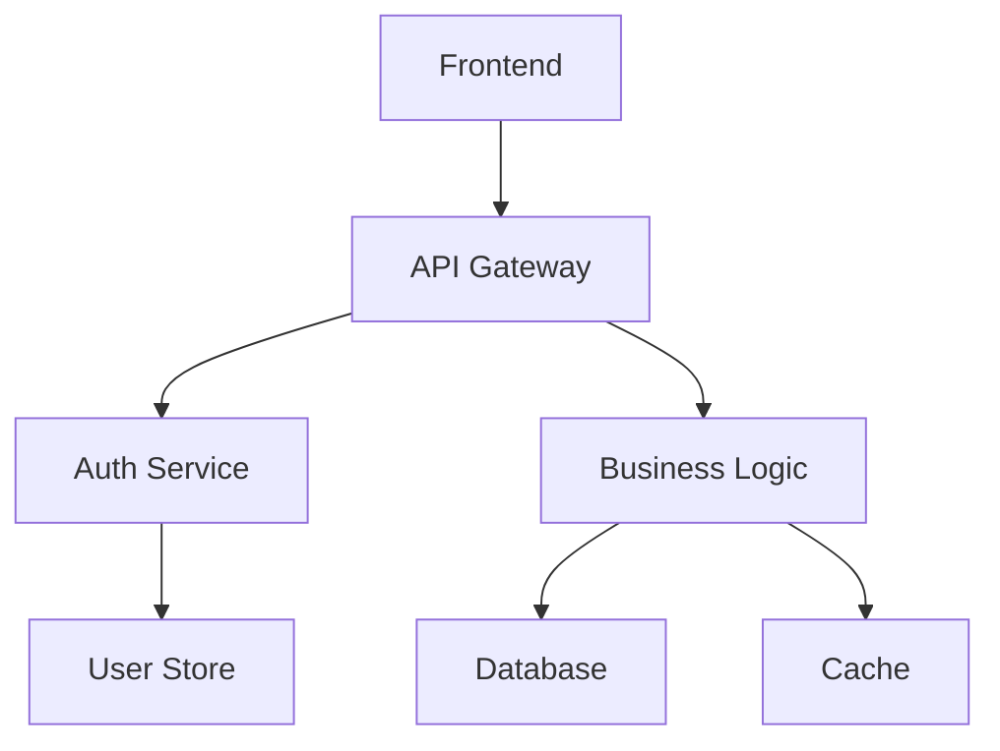
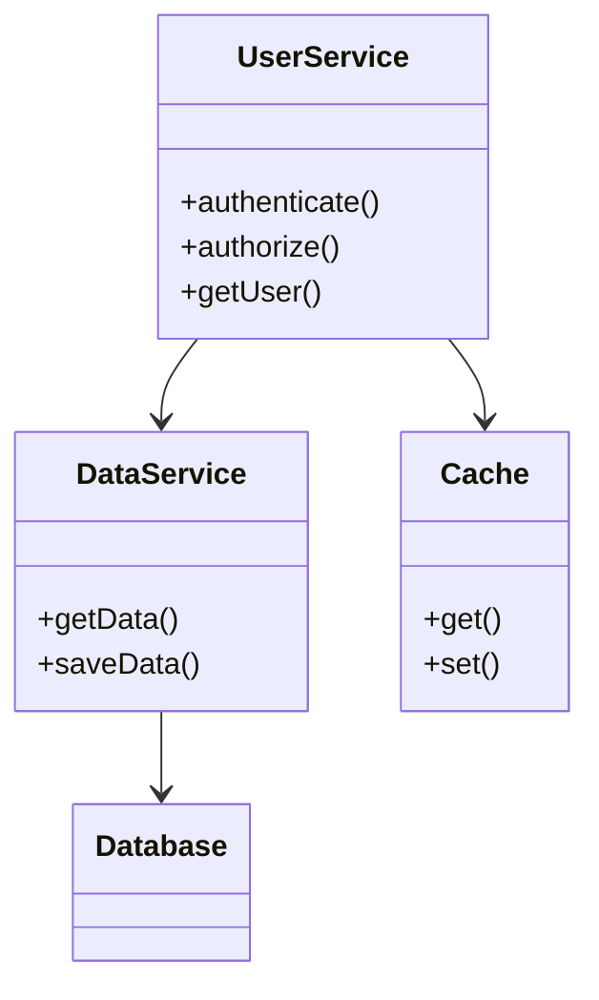
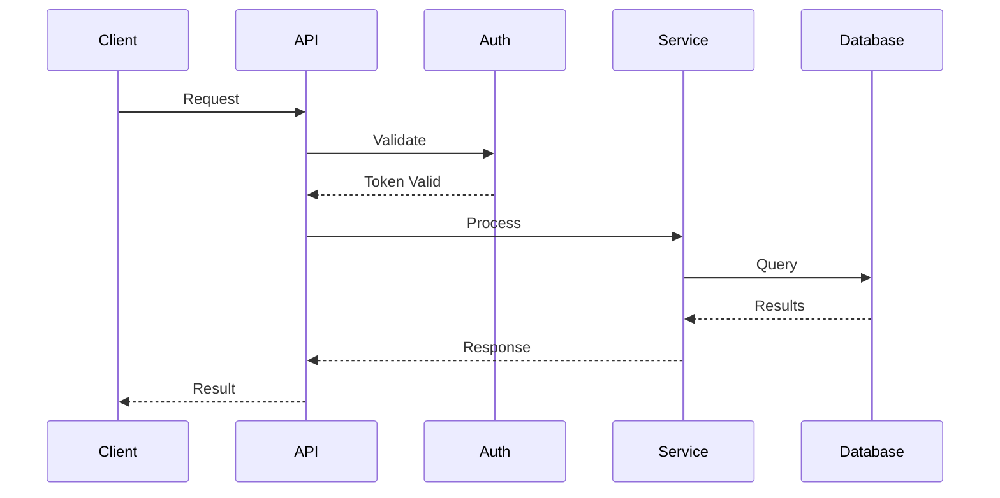
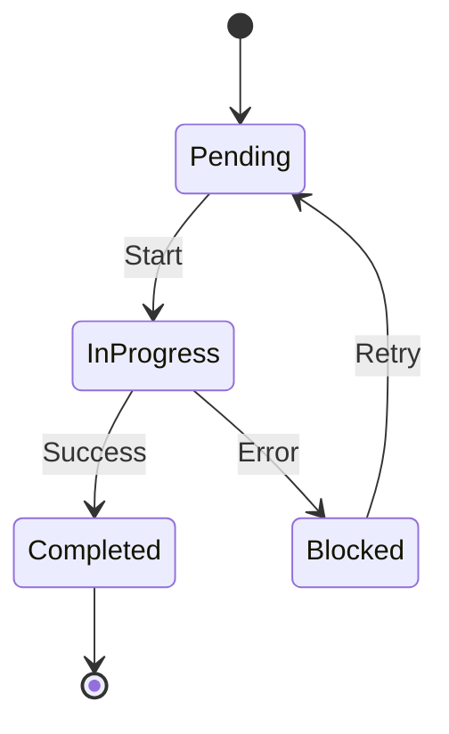
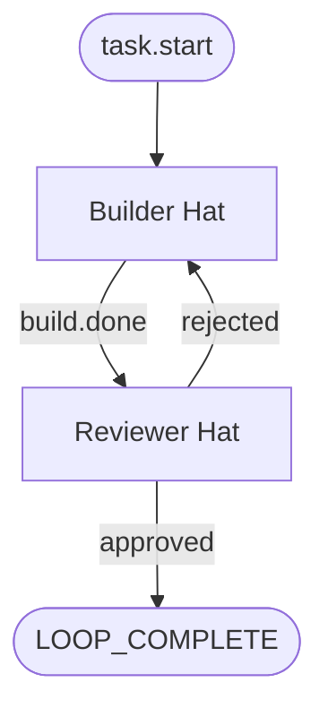
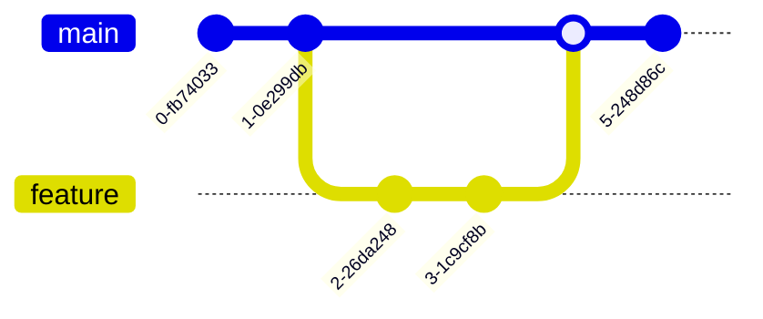
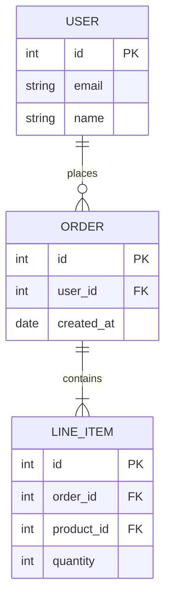
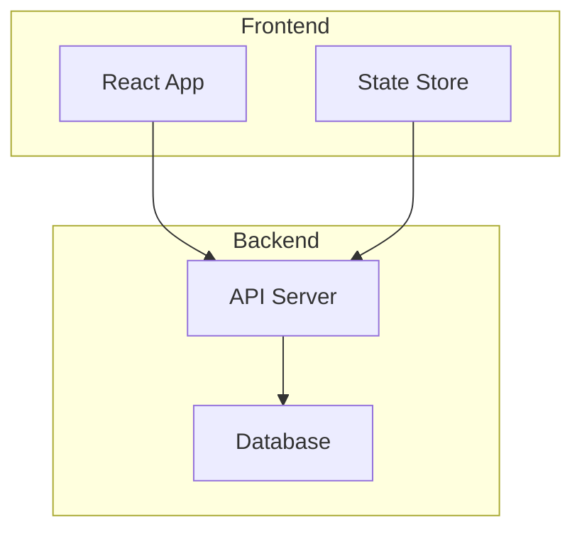
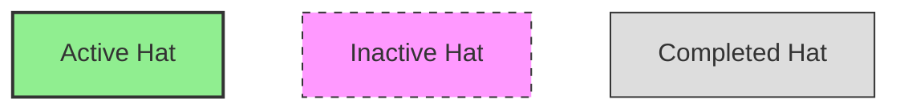
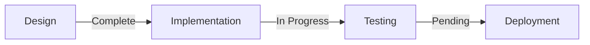

# Mermaid Diagram Patterns

Use this guide when creating visual diagrams in documentation, scratchpad, or analysis. Mermaid provides text-to-diagram conversion that renders in most Markdown viewers.

---

## Architecture Overview (graph TB)

Use for high-level system architecture and component relationships.



**When to use:**
- System architecture documentation
- Component dependency mapping
- Service topology visualization

**Naming conventions:**
- Nodes use PascalCase with spaces in brackets: `[Component Name]`
- Arrows indicate data flow: `-->`

---

## Component Relationships (classDiagram)

Use for showing class structures, interfaces, and relationships.



**When to use:**
- API design documentation
- Data model relationships
- Interface contracts

**Syntax elements:**
- `+` for public methods
- `-` for private methods
- `-->` for dependencies

---

## API Workflows (sequenceDiagram)

Use for showing request-response flows between components.



**When to use:**
- API flow documentation
- Debugging request chains
- Showing handoffs between services

**Syntax elements:**
- `->>` for synchronous calls
- `-->>` for responses
- Order shows sequence top-to-bottom

---

## State Transitions (stateDiagram-v2)

Use for showing workflow states and transitions.



**When to use:**
- Workflow state machines
- Task lifecycle documentation
- Status transition rules

**Syntax elements:**
- `[*]` for start/end states
- `:` labels on transitions
- States in PascalCase

---

## Event Flow (flowchart TD)

Use for showing Ralph event flows and hat coordination.



**When to use:**
- Ralph preset event flow design
- Hat coordination visualization
- Decision tree documentation

**Syntax elements:**
- `([name])` for start/end nodes (terminators)
- `[name]` for process nodes
- `|label|` on arrows for event names

---

## Git Workflow (git)

Use for showing branch and commit strategies.



**When to use:**
- Git workflow documentation
- Release strategy visualization
- Branching model explanation

---

## ER Diagrams (erDiagram)

Use for database schema visualization.



**When to use:**
- Database schema documentation
- Data model design
- Relationship visualization

**Syntax elements:**
- `||--o{` for one-to-many
- `||--|{` for one-to-many (required)
- `PK` / `FK` for key types

---

## Common Patterns

### Event Naming in Diagrams

Use consistent event names in flowcharts:
```
<phase>.ready / <phase>.done           # Phase transitions
<thing>.approved / <thing>.rejected    # Review gates
<noun>.found / <noun>.missing          # Discovery events
<action>.request / <action>.complete   # Request-response
```

### Subgraphs for Grouping



### Styling with Classes



---

## Rendering Tips

1. **Test in isolation** - Use [Mermaid Live Editor](https://mermaid.live) to validate diagrams
2. **Keep it simple** - Complex diagrams are hard to read
3. **Use consistent direction** - `TB` (top-bottom) or `LR` (left-right)
4. **Label clearly** - Node names should be self-explanatory
5. **Version compatibility** - Some features require specific Mermaid versions

---

## Quick Reference

| Diagram Type | Declaration | Use Case |
|--------------|-------------|----------|
| Flowchart | `flowchart TD` or `graph TB` | General flows, event routing |
| Sequence | `sequenceDiagram` | API calls, request chains |
| Class | `classDiagram` | Data models, interfaces |
| State | `stateDiagram-v2` | State machines, workflows |
| ER | `erDiagram` | Database schemas |
| Git | `gitGraph` | Branching strategies |

---

## Integration with Ralph

Use Mermaid diagrams in:
- **PROMPT.md** - Visual task breakdown
- **Scratchpad** - Progress visualization
- **Documentation** - Architecture diagrams
- **Hat instructions** - Flow clarifications

Example in scratchpad:
```markdown
## Current Progress


```
