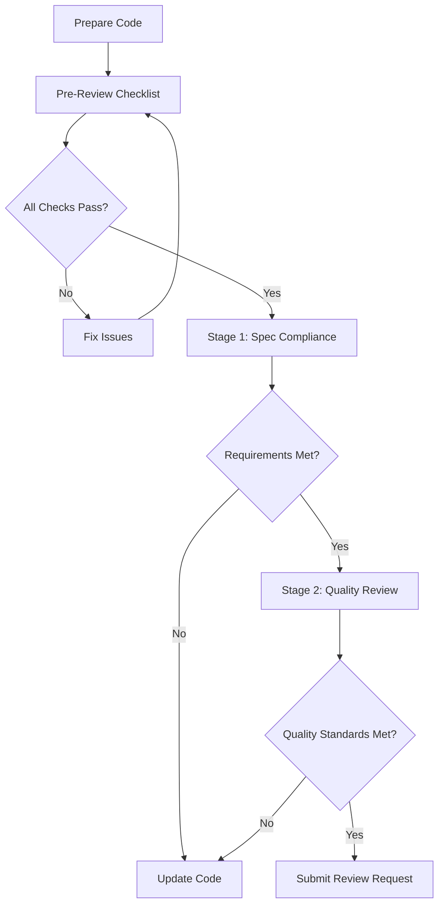

<mission_control>
<objective>Prepare code for review through pre-review checklist and two-stage review process.</objective>
<success_criteria>Pre-review checklist complete, two-stage review passed, review request formatted correctly</success_criteria>
</mission_control>

## The Path to High-Quality Review Success

### 1. Pre-Review Preparation Creates Efficiency

Investing time in self-review before requesting review reduces back-and-forth cycles. When tests pass, lint is clean, and code is self-audited, reviewers focus on substantive issues rather than catching basic problems. This preparation shows respect for reviewers' time and accelerates the merge process.

### 2. Two-Stage Review Prevents Context Switching

Separating spec compliance from quality review creates focused, efficient feedback loops. When reviewers verify requirements match specifications first (Stage 1), they provide clear direction before investing in architectural analysis (Stage 2). This order prevents wasted effort reviewing code that doesn't meet requirements.

### 3. Evidence-Based Feedback Builds Trust

Citing specific file:line references for issues enables precise fixes and demonstrates thorough review. When feedback includes exact locations, authors can address points efficiently without guessing or searching. This precision builds confidence in the review process.

### 4. Severity Categorization Prioritizes Effectively

Distinguishing Critical, Important, and Minor issues helps authors focus fixes where they matter most. Critical issues block merge; Important issues affect quality but allow discussion; Minor issues represent preferences. Clear categorization prevents merge delays from nitpicks while ensuring quality standards.

## Workflow

**Pre-review checklist:** Verify tests pass, lint clean, no TODOs left

**Stage 1 review:** Spec compliance check (requirements met, no extra features)

**Stage 2 review:** Architecture and quality review (patterns, consistency)

**Format request:** Generate structured review request with context

**Why:** Two-stage review catches spec issues first—reviewers focus on quality, not requirements.

## Navigation

| If you need...       | Read...                            |
| :------------------- | :--------------------------------- |
| Pre-review checklist | ## Workflow → Pre-review checklist |
| Stage 1 review       | ## Workflow → Stage 1 review       |
| Stage 2 review       | ## Workflow → Stage 2 review       |
| Format request       | ## Workflow → Format request       |
| Review process flow  | ## Review Process Flow             |
| Submit review        | Use `/review` command              |

## Review Process Flow



## Operational Patterns

This skill follows these behavioral patterns:

- **Tracking**: Maintain a visible task list for review preparation
- **Verification**: Verify code quality before requesting review
- **Management**: Manage task lifecycle for review stages

## Implementation Patterns

### Pattern 1: Pre-Review Checklist

```bash
# Run verification before requesting review
npm test  # All tests passing
npm run lint  # No lint errors
git diff --stat  # Review changes summary

# Self-review checklist
Grep: Search for "TODO\|FIXME\|XXX"  # Remove or address
Grep: Search for console.log\|debugger  # Clean up
```

### Pattern 2: Two-Stage Review Template

```markdown
## Stage 1: Spec Compliance

- [ ] All requirements implemented?
- [ ] No extra features added?
- [ ] Blueprint/spec followed?
- [ ] Acceptance criteria met?

## Stage 2: Quality Review

- [ ] Code quality standards met?
- [ ] Tests comprehensive?
- [ ] Documentation complete?
- [ ] Error handling proper?
```

### Pattern 3: Review Response Format

```markdown
## Spec Compliance Response

✅ **PASS** or ❌ **ISSUES FOUND**

Issues:

- [Critical/Important/Minor]: [Description] (file:line)
```

### Pattern 4: CI Integration

```bash
# Verify all checks pass before requesting review
npm run test:ci  # CI-style test run
npm run type-check  # TypeScript type check
npx knip  # Check for unused files/deps
```

## Troubleshooting

### Issue: Tests Failing

| Symptom                  | Solution                                       |
| ------------------------ | ---------------------------------------------- |
| Unit tests failing       | Fix failing tests before requesting review     |
| Integration tests        | Ensure test environment is properly configured |
| Coverage below threshold | Add missing tests or adjust threshold          |

### Issue: Missing Requirements

| Symptom                   | Solution                                  |
| ------------------------- | ----------------------------------------- |
| Feature not implemented   | Complete implementation before requesting |
| Acceptance criteria unmet | Verify each criterion is addressed        |
| Edge cases not covered    | Add tests for edge cases                  |

### Issue: Quality Issues Found

| Symptom                | Solution                                   |
| ---------------------- | ------------------------------------------ |
| Poor naming            | Rename variables/functions for clarity     |
| Missing error handling | Add proper try/catch and error propagation |
| Low test coverage      | Add unit tests for uncovered code paths    |

### Issue: Wrong Review Order

| Symptom                      | Solution                                  |
| ---------------------------- | ----------------------------------------- |
| Quality reviewed before spec | Always do spec compliance first           |
| Skipped spec compliance      | Verify requirements before quality checks |

## Workflows

### Before Requesting Review

1. **RUN TESTS** → All tests pass
2. **RUN LINT**
3. **SELF-REVIEW** → Check → No lint errors for TODOs, debug statements
4. **VERIFY CHANGES** → git diff --stat to confirm scope

### Two-Stage Review Process

```
Stage 1: Spec Compliance
├─ Verify all requirements implemented
├─ Check no extra features added
└─ Confirm blueprint/spec followed

Stage 2: Quality Review
├─ Check code quality standards
├─ Verify test coverage
├─ Ensure documentation complete
└─ Categorize issues by severity
```

### Review Response Workflow

1. **STAGE 1** → Spec compliance check
2. **REPORT** → Pass or list issues with file:line
3. **STAGE 2** → Quality review (only if Stage 1 passes)
4. **REPORT** → Approved or needs fixes with severity

---

## Pre-Review Checklist

Before requesting review:

### Code Quality

- [ ] All tests passing
- [ ] Code follows existing patterns
- [ ] No dead code or TODO comments
- [ ] Proper error handling
- [ ] Clear naming conventions
- [ ] Consistent formatting

### Documentation

- [ ] Code comments where needed
- [ ] README updated if applicable
- [ ] API documentation updated
- [ ] CHANGELOG updated

### Testing

- [ ] Unit tests added/updated
- [ ] Integration tests passing
- [ ] Edge cases covered
- [ ] Error scenarios tested

### Self-Review

- [ ] Reviewed own code first
- [ ] Fixed obvious issues
- [ ] Verified against requirements
- [ ] Checked portability

## Two-Stage Review Process

### Stage 1: Spec Compliance Review

**Purpose:** Verify implementation matches requirements exactly.

**Reviewer checks:**

- [ ] All requirements implemented?
- [ ] No extra features added?
- [ ] Blueprint/spec followed?
- [ ] Acceptance criteria met?

**Report format:**

```
✅ Spec Compliant
```

OR

```
❌ Issues Found:
- Missing: [specific requirement] (file:line)
- Extra: [unrequested feature] (file:line)
- Misunderstood: [requirement interpretation] (file:line)
```

### Stage 2: Quality Review

**Purpose:** Verify implementation quality and maintainability.

**Reviewer checks:**

- [ ] Code quality standards met
- [ ] Clear naming and structure
- [ ] Proper error handling
- [ ] Tests comprehensive
- [ ] Documentation complete
- [ ] Seed System patterns followed

**Report format:**

```
Strengths:
- [what was done well]

Issues:
- Critical: [must fix before merge]
- Important: [should fix for quality]
- Minor: [nice to have]

Assessment: Approved / Needs fixes
```

## Request Format

### For Manual Review

```markdown
## Code Review Request

**Changes:**

- [File 1]: [Description]
- [File 2]: [Description]

**Purpose:** [Why these changes]

**Testing:**

- [Test results]
- [How to verify]

**Notes:**
[Any important context]

Ready for review.
```

## Reviewer Guidelines

### For Spec Compliance Reviewers

**DO:**

- Verify requirements line by line
- Check for missing features
- Check for extra work
- Compare against blueprint/spec
- Cite specific file:line references

**DON'T:**

- Review code quality (that's Stage 2)
- Trust the implementation report
- Assume requirements are met
- Skip verification

### For Quality Reviewers

**DO:**

- Check code quality and structure
- Verify tests are comprehensive
- Ensure documentation is complete
- Follow Seed System patterns
- Categorize issues by severity

**DON'T:**

- Review spec compliance (already done in Stage 1)
- Accept "good enough" quality
- Skip error handling checks
- Ignore test coverage

## Example Workflow

### Complete Review Request

```
## Code Review Request

**Component:** User Authentication Skill
**Type:** Skill
**Files Changed:**
- .claude/skills/auth/SKILL.md
- .claude/skills/auth/references/examples.md
- tests/test_auth_skill.py

### Requirements
From blueprint.yaml:
- Implement OAuth authentication
- Support Google and GitHub providers
- Include token refresh
- Add logout functionality

### Implementation Summary
Built skill with:
- OAuth flow for Google and GitHub
- Token management (refresh, expiration)
- Logout endpoint
- Complete test coverage (95%)

### Testing
- Unit tests: 15/15 passing
- Integration tests: 8/8 passing
- Coverage: 95%
- Manual testing: OAuth flows verified

### Two-Stage Review

**Stage 1: Spec Compliance**
Please verify:
- [ ] All 4 requirements implemented?
- [ ] OAuth authentication (Google + GitHub)?
- [ ] Token refresh working?
- [ ] Logout functionality complete?
- [ ] No extra features added?

**Stage 2: Quality Review**
Please verify:
- [ ] Code follows Seed System patterns?
- [ ] Progressive disclosure tiers present?
- [ ] Test coverage adequate?
- [ ] Documentation clear and complete?
- [ ] Error handling proper?

Ready for review through both stages.
```

## Review Response

### Spec Compliance Response

```
✅ **Spec Compliance: PASS**

All requirements verified:
- ✅ OAuth authentication (Google + GitHub) - SKILL.md:45-78
- ✅ Token refresh - SKILL.md:89-112
- ✅ Logout functionality - SKILL.md:123-145
- ✅ No extra features

Ready for Stage 2: Quality Review.
```

OR

```
❌ **Spec Compliance: ISSUES FOUND**

Issues:
- Missing: Token refresh not implemented (SKILL.md:89-112 shows placeholder)
- Misunderstood: Logout clears token but doesn't revoke (requirements say "revoke")

Please fix these issues before Stage 2 review.
```

### Quality Review Response

```
✅ **Quality Review: APPROVED**

**Strengths:**
- Excellent test coverage (95%)
- Clear progressive disclosure structure
- Comprehensive examples in references/
- Proper error handling throughout

**Issues:**
- Minor: Could add more inline comments (Critical: none, Important: none, Minor: 1)

**Assessment:** Approved - Ready to merge
```

OR

```
❌ **Quality Review: NEEDS FIXES**

**Strengths:**
- Good test coverage
- Clear structure

**Issues:**
- Critical: Missing error handling for invalid tokens (SKILL.md:67)
- Important: Test coverage gap in token refresh (tests/test_auth.py:45-67)

Please fix Critical and Important issues before merge.
```

## Quick Reference

| Stage               | Purpose            | Checks                                     |
| ------------------- | ------------------ | ------------------------------------------ |
| **Spec Compliance** | Match requirements | All features, no extra, blueprint followed |
| **Quality**         | Code quality       | Standards, tests, docs, patterns           |

Requesting code review systematically ensures high-quality implementations through spec compliance and quality verification.

---

## Common Mistakes to Avoid

### Mistake 1: Skipping Pre-Review Checklist

❌ **Wrong:**
"Tests might be passing, let me just request review anyway"

✅ **Correct:**
Run full verification: `npm test` → `npm run lint` → `npx tsc --noEmit`

### Mistake 2: Reversing Review Stages

❌ **Wrong:**
Review quality before spec compliance → Wastes effort on code that doesn't meet requirements

✅ **Correct:**
Stage 1 first (spec compliance), then Stage 2 (quality review)

### Mistake 3: Vague Issue Descriptions

❌ **Wrong:**
"The error handling could be better"

✅ **Correct:**
"Critical: Missing error handling for invalid tokens (SKILL.md:67)"

### Mistake 4: Mixing Severity Levels

❌ **Wrong:**
Blocking merge on minor style preferences

✅ **Correct:**
- Critical: Must fix before merge
- Important: Should fix for quality
- Minor: Nice to have, doesn't block

### Mistake 5: Skipping Self-Review

❌ **Wrong:**
Requesting review without first reviewing your own changes

✅ **Correct:**
Self-review first: check TODOs, debug statements, naming, patterns

---

## Validation Checklist

Before requesting code review:

**Pre-Review Verification:**
- [ ] `npm test` passes all tests
- [ ] `npm run lint` reports no errors
- [ ] `tsc --noEmit` passes type check
- [ ] No TODO/FIXME/XXX comments remaining
- [ ] No console.log or debugger statements

**Self-Review:**
- [ ] Code follows existing patterns
- [ ] Naming is clear and consistent
- [ ] Error handling is proper
- [ ] Edge cases are covered

**Documentation:**
- [ ] README updated if needed
- [ ] API documentation complete
- [ ] Code comments where complex

**Two-Stage Review Readiness:**
- [ ] Stage 1: Spec compliance checklist prepared
- [ ] Stage 2: Quality review checklist prepared
- [ ] Review request formatted correctly

---

## Best Practices Summary

✅ **DO:**
- Run all verification commands before requesting review
- Complete the pre-review checklist systematically
- Use two-stage review (spec first, then quality)
- Cite specific file:line references for issues
- Categorize issues by severity (Critical/Important/Minor)
- Self-review your changes before requesting review

❌ **DON'T:**
- Skip tests or lint checks before requesting review
- Review quality before verifying spec compliance
- Use vague descriptions without file:line references
- Block merge on minor style preferences
- Skip self-review and rely on reviewers to catch obvious issues
- Submit incomplete work for review

---

## Recognition Questions

Self-verification questions for review quality:

- "Would Claude know this without being told?" → Delete (zero delta)
- "Can this work standalone?" → Fix if no (non-self-sufficient)
- "Did I read the actual file, or just see it in grep?" → Verify before claiming
- "Is spec compliance verified before quality review?" → Follow two-stage process
- "Are tests passing and lint clean?" → Complete pre-review checklist first

---

<critical_constraint>
**Portability Invariant:** This skill must work with zero .claude/rules dependencies (self-contained genetic code for context: fork isolation)
</critical_constraint>
