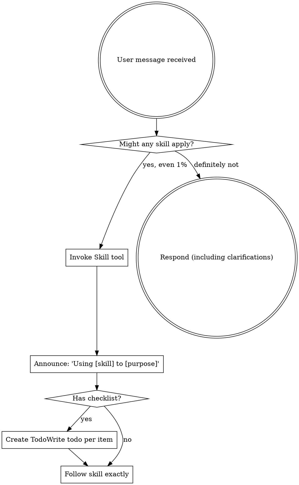

# Using Superpowers

## Overview

**CRITICAL: Use this skill at session start to establish systematic skill usage discipline.**

If you think there is even a 1% chance a skill might apply to what you are doing, you ABSOLUTELY MUST invoke the skill.

**IF A SKILL APPLIES TO YOUR TASK, YOU DO NOT HAVE A CHOICE. YOU MUST USE IT.**

This is not negotiable. This is not optional. You cannot rationalize your way out of this.

## The Rule

**Invoke relevant or requested skills BEFORE any response or action.** Even a 1% chance a skill might apply means that you should invoke the skill to check. If an invoked skill turns out to be wrong for the situation, you don't need to use it.

## How to Access Skills

**In Claude Code:** Use the `Skill` tool. When you invoke a skill, its content is loaded and presented to you—follow it directly. Never use the Read tool on skill files.

**In other environments:** Check your platform's documentation for how skills are loaded.

## Using Skills

### The Rule

**Invoke relevant or requested skills BEFORE any response or action.** Even a 1% chance a skill might apply means that you should invoke the skill to check. If an invoked skill turns out to be wrong for the situation, you don't need to use it.

### Flow Diagram



## Red Flags

These thoughts mean STOP—you're rationalizing:

| Rationalization (Stop)              | Reality                                                |
| ----------------------------------- | ------------------------------------------------------ |
| "This is just a simple question"    | Questions are tasks. Check for skills.                 |
| "I need more context first"         | Skill check comes BEFORE clarifying questions.         |
| "Let me explore the codebase first" | Skills tell you HOW to explore. Check first.           |
| "I can check git/files quickly"     | Files lack conversation context. Check for skills.     |
| "Let me gather information first"   | Skills tell you HOW to gather information.             |
| "This doesn't need a formal skill"  | If a skill exists, use it.                             |
| "I remember this skill"             | Skills evolve. Read current version.                   |
| "This doesn't count as a task"      | Action = task. Check for skills.                       |
| "The skill is overkill"             | Simple things become complex. Use it.                  |
| "I'll just do this one thing first" | Check BEFORE doing anything.                           |
| "This feels productive"             | Undisciplined action wastes time. Skills prevent this. |
| "I know what that means"            | Knowing the concept ≠ using the skill. Invoke it.      |

## Skill Priority

When multiple skills could apply, use this order:

1. **Process skills first** (brainstorming, debugging) - these determine HOW to approach the task
2. **Implementation skills second** (frontend-design, mcp-builder) - these guide execution

"Let's build X" → brainstorming first, then implementation skills.
"Fix this bug" → systematic-debugging first, then domain-specific skills.

## Skill Types

**Rigid** (TDD, debugging): Follow exactly. Don't adapt away discipline.

**Flexible** (patterns): Adapt principles to context.

The skill itself tells you which.

## User Instructions

Instructions say WHAT, not HOW. "Add X" or "Fix Y" doesn't mean skip workflows.

## When to Check for Skills

### Always Check

**Before:**

- Starting any task
- Asking clarifying questions
- Exploring codebase
- Gathering information
- Writing code
- Creating components
- Debugging issues
- Planning work

**If 1% chance skill applies → CHECK**

### Skill Categories

**Process Skills (Check First):**

- `systematic-debugging` - For any bug/issue
- `verification-before-completion` - Before claiming complete
- `engineering-lifecycle` - For any new code or implementation planning
- `brainstorming` - For any creative work

**Workflow Skills:**

- `subagent-driven-development` - For plan execution
- `executing-plans` - For batch execution
- `using-git-worktrees` - For isolated workspace
- `finishing-a-development-branch` - For completion
- `dispatching-parallel-agents` - For multiple issues

**Implementation Skills:**

- `invocable-development` - For creating commands and skills
- `agent-development` - For creating agents
- `hook-development` - For creating hooks
- `mcp-development` - For creating MCPs

## Integration with thecattoolkit_v3

When working on complex tasks:

1. **Start with using-superpowers** - Establish discipline
2. **Use brainstorming** - Refine requirements
3. **Use engineering-lifecycle** - Create implementation plan
4. **Use subagent-driven-development** - Execute with review
5. **Use verification-before-completion** - Verify before claiming done

### Example Integration

```
User: "I want to add user authentication to the app"

You: I'll use the using-superpowers skill to establish discipline, then use brainstorming to refine the requirements.

[Invoke using-superpowers]
[Invoke brainstorming]

After refining requirements:
[Use engineering-lifecycle to create implementation plan]
[Use using-git-worktrees to create workspace]
[Use subagent-driven-development to execute]
[Use verification-before-completion to verify]
[Use finishing-a-development-branch to complete]
```

## Common Mistakes

### Not Checking for Skills

❌ **Wrong:**

```
User: "Fix the auth bug"
You: Let me check the code first...

[Explores codebase without checking for systematic-debugging]
```

✅ **Right:**

```
User: "Fix the auth bug"
You: I need to check if any skills apply to this debugging task.

[Invoke systematic-debugging]
[Follow 4-phase debugging process]
```

### Rationalizing Skips

❌ **Wrong:**

```
"This is simple, I'll just fix it"
"I'll check the skill after I do this"
"This doesn't need the full process"
```

✅ **Right:**

```
"This is debugging → invoke systematic-debugging"
"This is creative work → invoke brainstorming"
"This is a task → check for applicable skills"
```

### Wrong Priority

❌ **Wrong:**

```
"Building feature" → Jump to implementation skill
```

✅ **Right:**

```
"Building feature" → brainstorming (process first) → implementation skill
```

## Recognition Questions

**Ask yourself:**

- "Is this debugging?" → Check systematic-debugging
- "Is this creative work?" → Check brainstorming
- "Is this implementation?" → Check engineering-lifecycle
- "Am I claiming completion?" → Check verification-before-completion
- "Is this a complex task?" → Check multiple skills

**If yes to any → Invoke the skill**

## The Discipline

### Non-Negotiable

**You must use skills when they apply:**

- No exceptions
- No rationalization
- No shortcuts
- If skill exists for this → use it

### Skill Evolution

**Skills evolve:**

- Read current version
- Don't assume you remember
- Invoke to get latest content
- Follow current guidance

### Progressive Disclosure

**Skills use progressive disclosure:**

- Tier 1: When to use (frontmatter)
- Tier 2: How to use (main content)
- Tier 3: Deep details (references)

**Use skill content directly:**

- Don't extract and adapt
- Use complete guidance
- Follow examples

## Red Flag Recognition

### Thinking Patterns to STOP

| Stop Thinking         | Start Thinking                               |
| --------------------- | -------------------------------------------- |
| "This is simple"      | "Does a skill exist for this?"               |
| "I'll check later"    | "Invoke skill first, then proceed"           |
| "I know what to do"   | "Use the skill to ensure best practices"     |
| "This is quick"       | "Quick tasks still need systematic approach" |
| "I can figure it out" | "Skills provide proven patterns"             |

### Reality Check

**Every time you think:**

- "I should check for a skill" → YES, do it now
- "A skill might apply" → YES, invoke it
- "This looks like X" → YES, use X skill
- "I'm about to do Y" → YES, check if Y skill exists

**Never:**

- Proceed without checking
- Assume you know better
- Rationalize skipping
- Make exceptions

## Key Principles

1. **1% rule** - If there's even a 1% chance, check
2. **Process first** - Process skills before implementation
3. **No rationalization** - Can't argue your way out
4. **Skills evolve** - Read current version
5. **Follow exactly** - Don't adapt away discipline

## Quick Reference

**When you see:**

- Bug/issue → systematic-debugging
- Creative work → brainstorming
- New code → engineering-lifecycle
- Planning → engineering-lifecycle
- Claims of completion → verification-before-completion

**Check for applicable skill FIRST, then proceed.**

## Summary

Using Superpowers is about **systematic discipline**. Skills exist to enforce best practices and prevent common failures.

**The rule is simple:** If a skill might apply, you MUST invoke it. No exceptions. No rationalization. No shortcuts.

**Skills make you better** by enforcing systematic approaches that prevent mistakes and ensure quality.

**Trust the process** and follow skills exactly as written.

---

<critical_constraint>
MANDATORY: Invoke relevant skills BEFORE any response or action
MANDATORY: If there's even 1% chance a skill applies, invoke it
MANDATORY: Process skills before implementation skills
MANDATORY: Read current skill version (don't assume you remember)
No exceptions. Rationalization is the enemy of discipline.
</critical_constraint>
